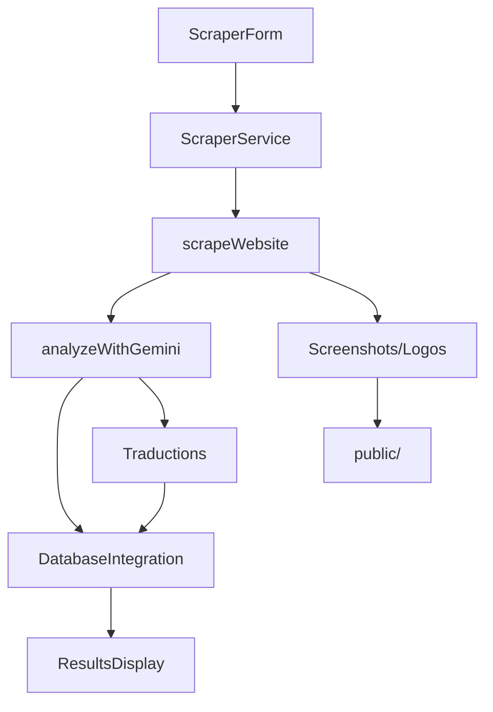

# Structure du Projet Video-IA.net

## 📁 Organisation des Dossiers

### `/app` - Next.js App Router
Interface utilisateur et routes API selon les conventions Next.js 14.

```
app/
├── api/scrape/route.ts     # Endpoint principal de scraping
├── globals.css             # Styles globaux Tailwind
├── layout.tsx              # Layout racine de l'application
└── page.tsx                # Page d'accueil principale
```

### `/src` - Code Source Principal
Organisation modulaire du code source avec séparation claire des responsabilités.

#### `/src/components` - Composants React
```
components/
├── ui/                     # Composants d'interface utilisateur
│   ├── ScraperForm.tsx     # Formulaire de saisie URL
│   ├── ResultsDisplay.tsx  # Affichage des résultats d'analyse
│   └── LoadingSpinner.tsx  # Indicateur de chargement
├── forms/                  # Composants de formulaires spécialisés
├── display/                # Composants d'affichage de données
└── common/                 # Composants réutilisables
```

#### `/src/lib` - Librairies et Intégrations
```
lib/
├── scraper/
│   └── core.ts            # Logique de scraping Puppeteer/Cheerio
├── ai/
│   └── analyzer.ts        # Intégration Google Gemini AI
├── database/
│   ├── schema.sql         # Schéma PostgreSQL multilingue
│   ├── types.ts           # Types TypeScript pour la DB
│   └── integration.ts     # Couche d'accès aux données
└── translations/          # Gestion des traductions
```

#### `/src/types` - Définitions TypeScript
```
types/
├── index.ts               # Export centralisé des types
├── scraper.ts             # Types pour le scraping
└── analysis.ts            # Types pour l'analyse IA
```

#### `/src/services` - Services Métier
```
services/
└── scraper.ts             # Orchestration du workflow complet
```

#### `/src/utils` - Utilitaires
```
utils/
└── content.ts             # Génération de contenu SEO
```

#### Dossiers Futurs
```
├── hooks/                 # Custom React hooks
├── constants/             # Constantes de l'application
└── context/               # Contextes React
```

### `/docs` - Documentation
```
docs/
├── api/                   # Documentation de l'API
├── components/            # Documentation des composants
└── database/              # Documentation base de données
```

### `/public` - Fichiers Statiques
```
public/
├── assets/                # Assets généraux (images, icônes)
├── screenshots/           # Screenshots capturés par le scraper
└── logos/                 # Logos extraits des sites web
```

### Dossiers Futurs
```
├── scripts/               # Scripts utilitaires et de maintenance
└── tests/                 # Tests unitaires et d'intégration
```

## 🏗️ Principes d'Architecture

### 1. Séparation des Responsabilités

- **UI Layer** (`app/`, `src/components/`): Interface utilisateur et présentation
- **Business Logic** (`src/services/`, `src/lib/`): Logique métier et intégrations
- **Data Layer** (`src/lib/database/`): Accès aux données et persistance
- **Types** (`src/types/`): Contrats TypeScript centralisés

### 2. Modularité

Chaque module a une responsabilité claire :
- `scraper/core.ts` - Extraction de données web
- `ai/analyzer.ts` - Analyse et traitement IA
- `database/integration.ts` - Persistance multilingue
- `services/scraper.ts` - Orchestration du workflow

### 3. Évolutivité

Structure préparée pour :
- Ajout de nouveaux composants UI
- Intégration de nouveaux services IA
- Extension des capacités de scraping
- Support de nouvelles langues

## 🔄 Flux de Données



## 📝 Conventions de Nommage

### Fichiers
- **Composants**: PascalCase (`ScraperForm.tsx`)
- **Services**: camelCase (`scraper.ts`)
- **Types**: camelCase (`analysis.ts`)
- **Utilitaires**: camelCase (`content.ts`)

### Dossiers
- **Composants**: kebab-case (`ui/`, `forms/`)
- **Services**: camelCase (`scraper/`, `database/`)
- **Documentation**: kebab-case (`api/`, `components/`)

### Variables et Fonctions
- **Fonctions**: camelCase (`scrapeWebsite`, `analyzeWithGemini`)
- **Constantes**: UPPER_SNAKE_CASE (`LANGUAGE_MAPPINGS`)
- **Interfaces**: PascalCase (`ToolAnalysis`, `ScrapingResult`)

## 🚀 Points d'Extension

### Nouveaux Composants
1. Créer dans `/src/components/[category]/`
2. Ajouter les types dans `/src/types/`
3. Documenter dans `/docs/components/`

### Nouveaux Services
1. Créer dans `/src/services/`
2. Ajouter les types associés
3. Intégrer dans le workflow principal

### Nouvelles Intégrations
1. Ajouter dans `/src/lib/[integration]/`
2. Définir les interfaces dans `/src/types/`
3. Documenter l'API dans `/docs/api/`

## 📊 Métriques de Qualité

### Structure
- ✅ Séparation claire des responsabilités
- ✅ Modules faiblement couplés
- ✅ Types TypeScript complets
- ✅ Documentation intégrée

### Maintenabilité
- ✅ Nommage cohérent
- ✅ Structure prévisible
- ✅ Imports organisés
- ✅ Code commenté en JSDoc

### Évolutivité
- ✅ Architecture modulaire
- ✅ Points d'extension définis
- ✅ Configuration centralisée
- ✅ Tests futurs plannifiés

Cette structure garantit un code propre, maintenable et évolutif pour l'équipe Video-IA.net.