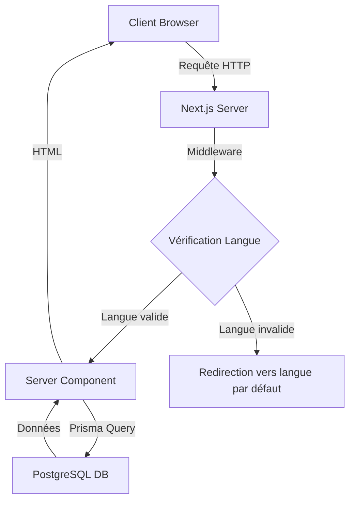
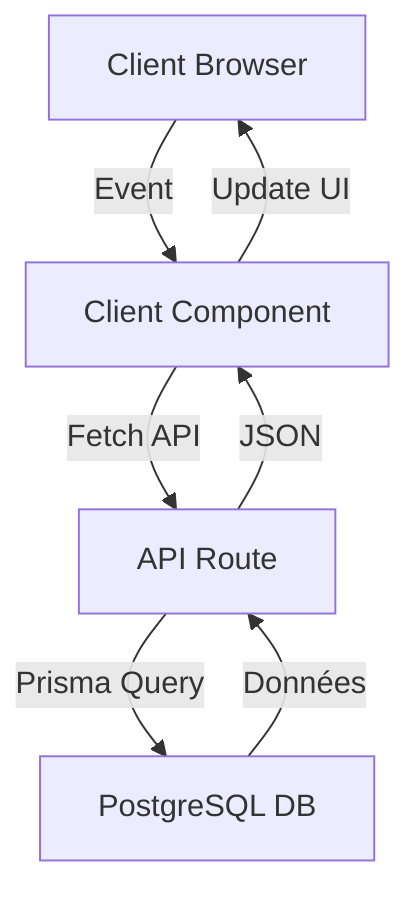
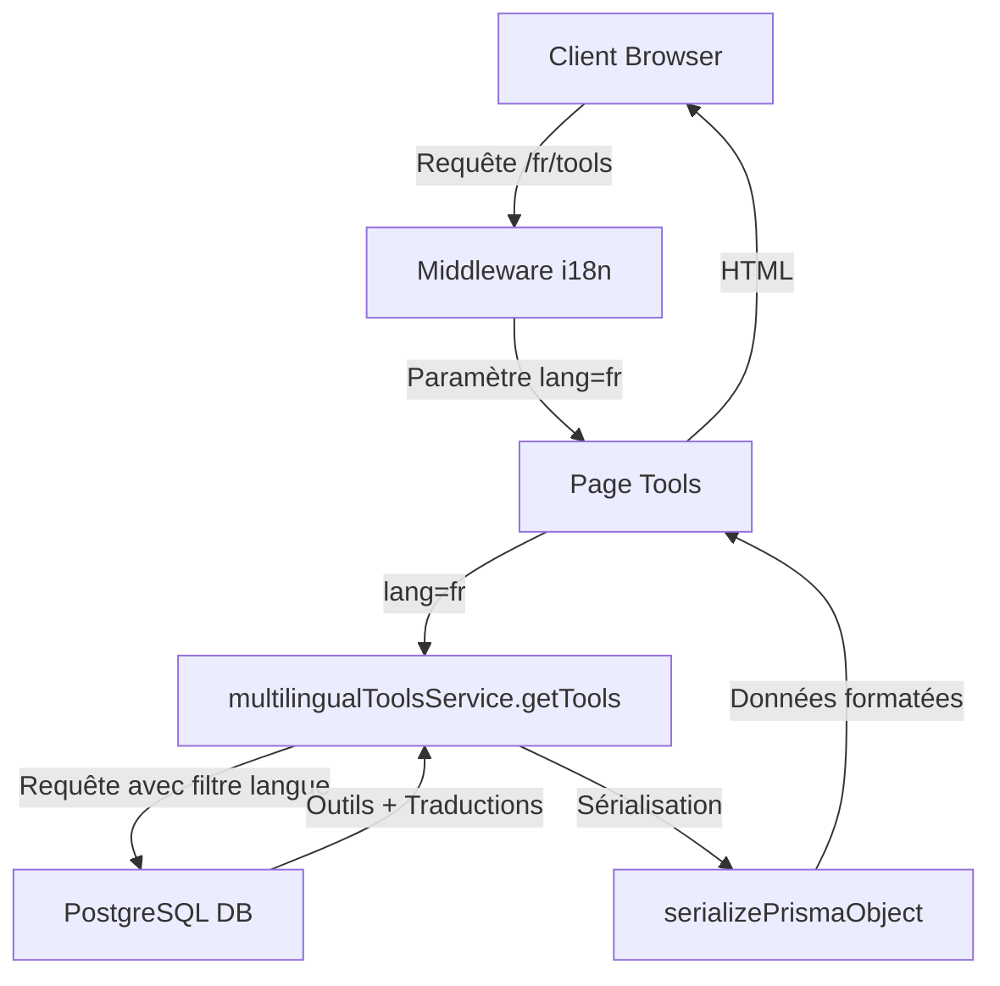

# Architecture Générale de VideoIA.net

*Date de dernière mise à jour : 16 août 2025*

## Table des Matières
1. [Vue d'Ensemble](#vue-densemble)
2. [Stack Technologique](#stack-technologique)
3. [Structure des Dossiers](#structure-des-dossiers)
4. [Flux de Données](#flux-de-données)
5. [Patterns Architecturaux](#patterns-architecturaux)
6. [Diagrammes d'Architecture](#diagrammes-darchitecture)
7. [Environnements](#environnements)
8. [Dépendances Principales](#dépendances-principales)

## Vue d'Ensemble

VideoIA.net est une application web moderne construite sur Next.js qui sert de répertoire complet d'outils d'intelligence artificielle, avec un focus particulier sur les outils de création vidéo et de contenu. Le site présente plus de 16 765 outils IA organisés en 140 catégories, avec une prise en charge complète de 7 langues.

L'architecture suit les principes suivants :
- **Séparation des préoccupations** - Distinction claire entre l'interface utilisateur, la logique métier et l'accès aux données
- **Internationalisation native** - Support multilingue intégré à tous les niveaux
- **Performance optimisée** - Utilisation des Server Components de Next.js pour un rendu optimal
- **Scalabilité** - Architecture modulaire permettant une évolution facile

## Stack Technologique

### Frontend
- **Framework** : Next.js 15.0.0 avec App Router (fichier: `/next.config.js`)
- **Langage** : TypeScript 5.3.3 (fichier: `/tsconfig.json`)
- **Styling** : TailwindCSS 3.4.1 (fichier: `/tailwind.config.js`)
- **Composants UI** : Système de composants personnalisés (dossier: `/src/components/ui/`)
- **Gestion d'État** : React Context API + React Hooks (dossier: `/src/hooks/`)
- **Rendu** : Mélange de Server Components et Client Components

### Backend
- **API Routes** : API Routes de Next.js (dossier: `/app/api/`)
- **ORM** : Prisma 5.5.2 (fichier: `/prisma/schema.prisma`)
- **Authentification** : NextAuth.js 4.24.5 (dossier: `/src/lib/auth/`)
- **Validation** : Zod 3.22.4 (utilisé dans `/src/lib/validation/`)

### Base de Données
- **SGBD** : PostgreSQL 16.9 
- **Hébergement** : Local sur le serveur (`localhost:5432`)
- **Nom de la BD** : `video_ia_net`
- **Utilisateur** : `video_ia_user`

### Infrastructure
- **Hébergement** : Serveur Ubuntu local
- **Serveur Web** : Node.js avec serveur intégré de Next.js
- **Environnement d'Exécution** : Node.js 18.19.0

## Structure des Dossiers

La structure de dossiers suit les conventions de Next.js avec App Router, avec quelques personnalisations pour l'organisation du projet :

```
video-ia.net/
├── .archive/                  # Documentation et fichiers archivés
│   ├── docs/                  # Documentation archivée
│   ├── development-notes/     # Notes de développement
│   └── manual/                # Documentation utilisateur et technique
├── .github/                   # Configuration GitHub et workflows CI/CD
│   └── workflows/             # Workflows GitHub Actions
├── app/                       # Structure App Router de Next.js
│   ├── [lang]/                # Routes multilingues (paramètre dynamique)
│   │   ├── page.tsx           # Page d'accueil (/fr, /en, etc.)
│   │   ├── layout.tsx         # Layout principal avec navigation
│   │   ├── categories/        # Pages des catégories
│   │   │   ├── page.tsx       # Liste des catégories (/fr/categories)
│   │   │   └── [slug]/        # Pages de catégorie spécifique
│   │   │       └── page.tsx   # Détail d'une catégorie (/fr/categories/video-editing)
│   │   └── tools/             # Pages des outils
│   │       ├── page.tsx       # Liste des outils (/fr/tools)
│   │       └── [slug]/        # Pages d'outil spécifique
│   │           └── page.tsx   # Détail d'un outil (/fr/tools/chatgpt)
│   ├── admin/                 # Interface d'administration
│   │   ├── layout.tsx         # Layout admin avec navigation
│   │   ├── page.tsx           # Dashboard admin (/admin)
│   │   ├── tools/             # Gestion des outils (/admin/tools)
│   │   └── categories/        # Gestion des catégories (/admin/categories)
│   └── api/                   # Routes API
│       ├── tools/             # API des outils (/api/tools)
│       │   └── route.ts       # Handlers GET, POST, PUT, DELETE
│       ├── categories/        # API des catégories (/api/categories)
│       │   └── route.ts       # Handlers GET, POST, PUT, DELETE
│       └── data-extraction/   # API d'extraction de données (/api/data-extraction)
│           └── route.ts       # Handlers pour extraction de données
├── config/                    # Fichiers de configuration
│   ├── site.ts                # Configuration du site (métadonnées, URLs)
│   └── navigation.ts          # Configuration de la navigation
├── prisma/                    # Configuration Prisma
│   ├── schema.prisma          # Schéma de base de données
│   └── migrations/            # Migrations de base de données
├── public/                    # Fichiers statiques
│   ├── images/                # Images et assets
│   │   ├── logos/             # Logos du site et des partenaires
│   │   ├── tools/             # Images des outils
│   │   └── placeholders/      # Images placeholder
│   ├── locales/               # Fichiers de traduction statiques
│   └── favicon.ico            # Favicon du site
├── scripts/                   # Scripts utilitaires
│   ├── deploy.sh              # Script de déploiement
│   ├── check-setup.ts         # Vérification de la configuration
│   └── import-data.ts         # Import de données
├── src/                       # Code source principal
│   ├── components/            # Composants React
│   │   ├── layout/            # Composants de mise en page
│   │   │   ├── ModernHeader.tsx  # En-tête principal
│   │   │   └── Footer.tsx     # Pied de page
│   │   ├── tools/             # Composants liés aux outils
│   │   │   ├── ToolCard.tsx   # Carte d'affichage d'un outil
│   │   │   ├── ToolsGrid.tsx  # Grille d'outils
│   │   │   └── AdvancedFilters.tsx # Filtres de recherche avancés
│   │   └── ui/                # Composants UI réutilisables
│   │       ├── Button.tsx     # Bouton personnalisé
│   │       ├── Card.tsx       # Carte UI
│   │       └── Container.tsx  # Conteneur de mise en page
│   ├── hooks/                 # Hooks React personnalisés
│   │   ├── useWebVitals.ts    # Hook pour mesurer les Core Web Vitals
│   │   └── useLocalStorage.ts # Hook pour gérer le localStorage
│   └── lib/                   # Bibliothèques et utilitaires
│       ├── auth/              # Configuration d'authentification
│       │   ├── config.ts      # Configuration NextAuth
│       │   └── adminMiddleware.ts # Middleware d'authentification admin
│       ├── database/          # Services de base de données
│       │   ├── client.ts      # Client Prisma singleton
│       │   └── services/      # Services d'accès aux données
│       │       ├── tools.ts   # Service CRUD pour les outils
│       │       ├── categories.ts # Service CRUD pour les catégories
│       │       ├── multilingual-tools.ts # Service pour les outils multilingues
│       │       └── multilingual-categories.ts # Service pour les catégories multilingues
│       ├── i18n/              # Configuration internationalisation
│       │   ├── types.ts       # Types et constantes i18n
│       │   └── context.tsx    # Contexte React pour i18n
│       ├── services/          # Services métier
│       │   ├── dataExtraction.ts # Extraction de données structurées
│       │   └── emojiMapping.ts # Mapping des catégories vers des emojis
│       └── utils/             # Utilitaires généraux
│           ├── prismaHelpers.ts # Helpers pour Prisma (sérialisation)
│           └── formatters.ts  # Fonctions de formatage
├── middleware.ts              # Middleware Next.js (i18n, auth)
├── next.config.js             # Configuration Next.js
├── package.json               # Dépendances npm
├── tailwind.config.js         # Configuration TailwindCSS
└── tsconfig.json              # Configuration TypeScript
```

## Flux de Données

Le flux de données dans VideoIA.net suit généralement ces patterns :

### 1. Chargement Initial des Pages



### 2. Interactions Client



### 3. Flux de Données Multilingues



## Patterns Architecturaux

### Server Components vs Client Components

VideoIA.net utilise le modèle hybride de Next.js App Router :

1. **Server Components** (`app/[lang]/tools/page.tsx`) :
   - Chargement des données directement depuis la base de données
   - Génération du HTML côté serveur
   - Pas d'état client ou d'interactivité
   - Optimisés pour le SEO et la performance initiale

2. **Client Components** (`src/components/tools/ToolsPageClient.tsx`) :
   - Marqués avec `'use client'` en haut du fichier
   - Gèrent l'état et l'interactivité
   - Utilisent des hooks React
   - Optimisés pour l'expérience utilisateur

### Pattern de Service

Les accès à la base de données sont encapsulés dans des services spécialisés :

```typescript
// src/lib/database/services/multilingual-tools.ts
export class MultilingualToolsService {
  static async getToolBySlug(slug: string, lang: SupportedLanguage): Promise<ToolWithTranslation | null> {
    // Implémentation...
  }
  
  static async searchTools(params: ToolsSearchParams): Promise<PaginatedToolsResult> {
    // Implémentation...
  }
}
```

### Pattern de Cache

Un système de cache en mémoire est implémenté pour les requêtes fréquentes :

```typescript
// Exemple simplifié du pattern de cache utilisé
private static cache = new Map<string, { data: any; timestamp: number }>()

private static getCachedData(key: string): any | null {
  const cached = this.cache.get(key)
  if (cached && Date.now() - cached.timestamp < CACHE_DURATION) {
    return cached.data
  }
  return null
}

private static setCachedData(key: string, data: any): void {
  this.cache.set(key, { data, timestamp: Date.now() })
}
```

## Diagrammes d'Architecture

### Architecture Globale

```
+---------------------+     +----------------------+     +---------------------+
|                     |     |                      |     |                     |
|  Client Browser     |<--->|  Next.js Server      |<--->|  PostgreSQL DB      |
|  - React Components |     |  - App Router        |     |  - Tools            |
|  - TailwindCSS      |     |  - API Routes        |     |  - Categories       |
|  - Client-side JS   |     |  - Server Components |     |  - Translations     |
|                     |     |  - Middleware        |     |                     |
+---------------------+     +----------------------+     +---------------------+
                                      ^
                                      |
                                      v
                            +----------------------+
                            |                      |
                            |  File System         |
                            |  - Static Assets     |
                            |  - Images            |
                            |  - Public Files      |
                            |                      |
                            +----------------------+
```

### Architecture des Composants

```
+-------------------+     +-------------------+     +-------------------+
|                   |     |                   |     |                   |
|  Layout           |     |  Page Components  |     |  UI Components    |
|  - ModernHeader   |     |  - HomePage       |     |  - Button         |
|  - Footer         |     |  - ToolsPage      |     |  - Card           |
|  - Navigation     |     |  - CategoryPage   |     |  - Container      |
|                   |     |                   |     |                   |
+-------------------+     +-------------------+     +-------------------+
          ^                        ^                        ^
          |                        |                        |
          v                        v                        v
+------------------------------------------------------------------+
|                                                                  |
|                      Client Components                           |
|  - ToolsPageClient                                               |
|  - AdvancedFilters                                               |
|  - SearchBar                                                     |
|                                                                  |
+------------------------------------------------------------------+
          ^                        ^                        ^
          |                        |                        |
          v                        v                        v
+-------------------+     +-------------------+     +-------------------+
|                   |     |                   |     |                   |
|  Services         |     |  Hooks            |     |  Utils            |
|  - Tools Service  |     |  - useWebVitals   |     |  - formatters     |
|  - Categories     |     |  - useLocalStorage|     |  - prismaHelpers  |
|  - Data Extraction|     |  - useDebounce    |     |  - validators     |
|                   |     |                   |     |                   |
+-------------------+     +-------------------+     +-------------------+
```

## Environnements

VideoIA.net est configuré pour fonctionner dans trois environnements distincts :

### Développement
- **URL** : `http://localhost:3000`
- **Command** : `npm run dev`
- **Fichier de Configuration** : `.env.development.local`
- **Base de Données** : Instance PostgreSQL locale
- **Features** : Hot Reloading, Debug Logging, Error Verbose

### Staging
- **URL** : `https://staging.video-ia.net`
- **Command** : `npm run build && npm run start`
- **Fichier de Configuration** : `.env.staging`
- **Base de Données** : Instance PostgreSQL de staging
- **Features** : Configuration proche de la production, données de test

### Production
- **URL** : `https://video-ia.net`
- **Command** : `npm run build && npm run start` (via PM2)
- **Fichier de Configuration** : `.env.production`
- **Base de Données** : Instance PostgreSQL de production
- **Features** : Optimisations de performance, logging minimal

## Dépendances Principales

Les dépendances principales du projet sont définies dans `package.json` :

| Dépendance | Version | Description | Utilisation |
|------------|---------|-------------|-------------|
| next | 15.0.0 | Framework React | Framework principal |
| react | 18.3.0 | Bibliothèque UI | Composants UI |
| react-dom | 18.3.0 | Rendu React | Rendu DOM |
| typescript | 5.3.3 | Langage typé | Typage statique |
| @prisma/client | 5.5.2 | Client ORM | Accès base de données |
| prisma | 5.5.2 | ORM | Définition schéma |
| tailwindcss | 3.4.1 | Framework CSS | Styling |
| next-auth | 4.24.5 | Authentification | Système d'auth |
| zod | 3.22.4 | Validation | Validation données |
| lucide-react | 0.294.0 | Icônes | UI Icons |

Pour une liste complète des dépendances, voir le fichier `package.json` à la racine du projet.

---

*Cette documentation est maintenue par l'équipe de développement VideoIA.net. Pour toute question ou suggestion, veuillez contacter l'équipe technique.*
